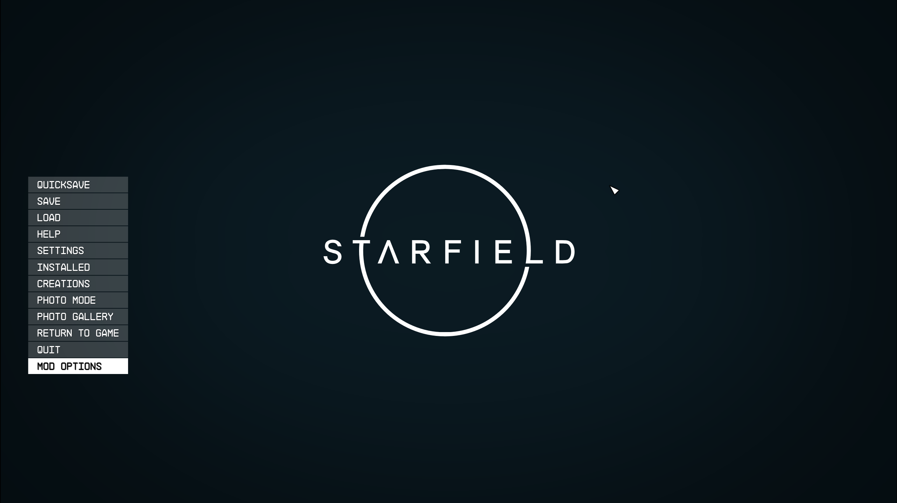
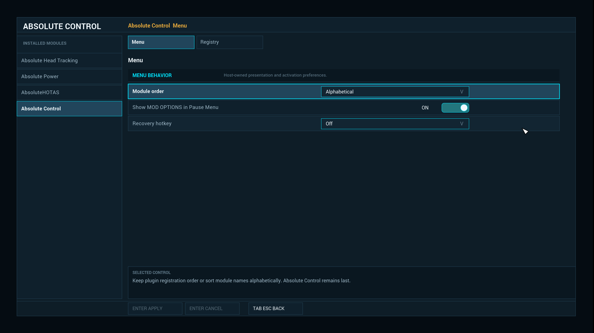
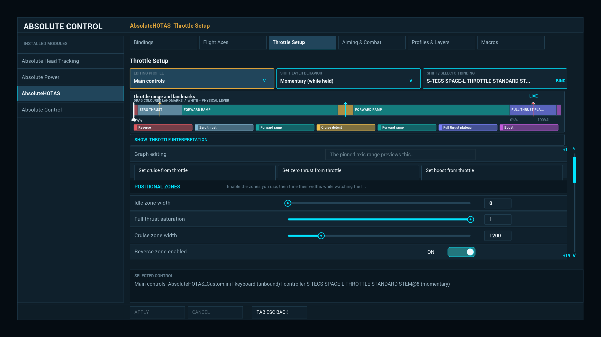
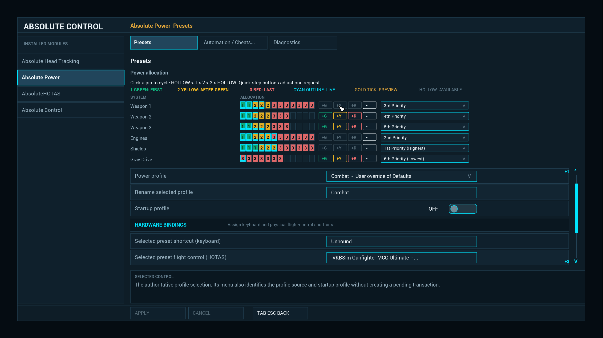
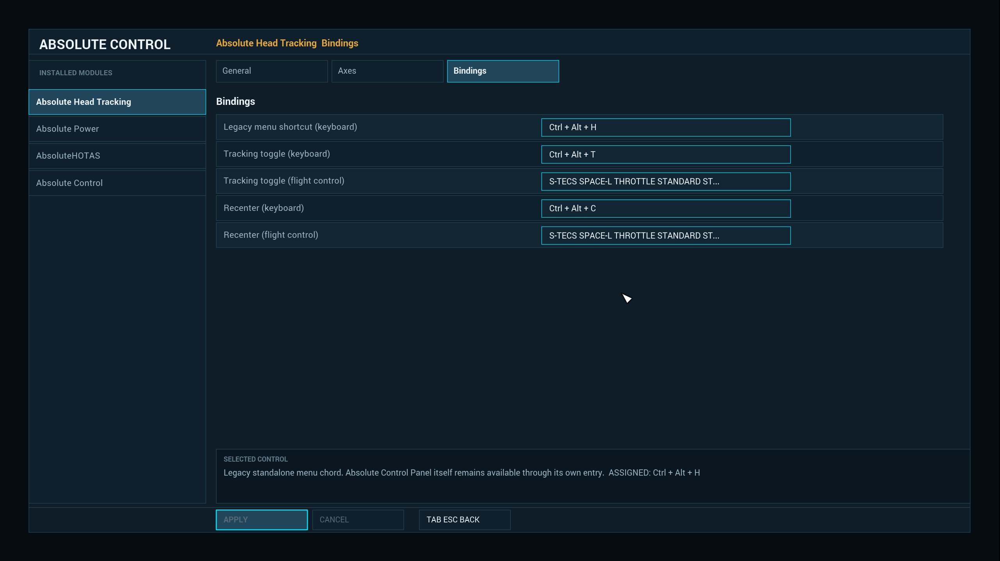

# Interface examples

These captures show the current Absolute Control host running real suite providers. They are
capability examples, not a pixel-layout contract: the host owns navigation, focus, layout, theme,
and rendering, while each provider owns its semantics, live data, validation, transactions, and
persistence.

## Native Pause Menu entry

Absolute Control enters through Starfield's native Pause Menu as **MOD OPTIONS**. Subscriber mods do
not patch the Pause Menu or ship a competing menu shell; they register with the host when available
and retain their standalone behavior when it is absent.

## Shared module shell and host controls

The host provides consistent module navigation, page tabs, focus treatment, contextual help, and
Apply/Cancel behavior. This view also demonstrates that Absolute Control is a provider in its own
menu: host-owned preferences use the same semantic controls and transaction model exposed to other
modules.

## Live composed tuning surface

AbsoluteHOTAS combines pinned profile and shift-layer context, page tabs, grouped controls, a live
range frame, semantic bands, provider markers, and ordinary sliders and actions. The graph is built
from bounded live-component data and semantic composition; it is not an arbitrary provider drawing
surface. When advanced capabilities are unavailable, the provider's ordinary page order remains the
task-complete fallback.

## Domain-specific record and grid editor

Absolute Power demonstrates a selected-record workflow around a segmented allocation grid. The
same page associates live capacity with editable tier cells, inline quick-step actions, row choices,
profile selection and renaming, startup behavior, and keyboard or physical-controller bindings.
Power remains authoritative for draft state, validation, preview, Apply/Cancel, and persistence.

## Keyboard and provider-owned input bindings

Absolute Head Tracking places keyboard chords and physical flight-control bindings in one standard
page. Keyboard capture is host-provided. Controller and POV capture can be supplied through an
optional provider-owned input bus, allowing modules to share a consistent binding workflow without
making that bus—or AbsoluteHOTAS—a gameplay dependency.

## What these examples do not promise

- Providers do not select coordinates, dimensions, fonts, colors, or textures.
- Exact spacing and visual treatment may evolve with the host.
- Optional live and composition APIs must be discovered, size-checked, and capability-gated.
- Every advanced page must preserve a complete ordinary-control fallback.
- Configuration ownership never transfers from the provider to Absolute Control.

For the stable descriptor contract, start with [the SDK guide](README.md). For current advanced
capability boundaries, see [SDK status](../docs/SDK-STATUS.md),
[live components](../docs/LIVE-COMPONENTS.md), and the
[subscriber UI standard](../docs/SUBSCRIBER-UI-STANDARD.md).
